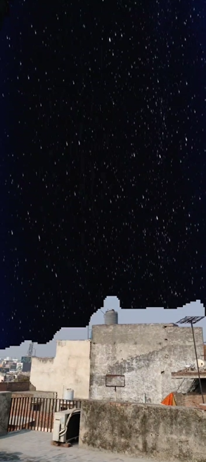

# 💡 World Texturing with Semantic Segmentation
This project makes use of Lightship ARDK's Semantic Segmentation to segment the world into different labels for example <b>skies</b> are labelled as <b>sky</b> or <b>trees</b> as <b>foliage</b>

With these segmented labels we can easily put textures on top of environments which can produce phenomenal Augmented Reality Experiences thus effecting the look of the actual world, sounds amazing right!

So, here goes a demo showcasing the replacement of the sky with an image by using ARDK's Semantic Segmentation

## ⚒️ Development Tools
* Unity Engine 2021.3.15f1
* Lightship ARDK 2.3.1
* Visual Studio 2019

## ⚒️ Running Locally
Make sure to use Unity 2020 or higher versions for this project to work properly.
* Download [Unity Hub](https://unity3d.com/get-unity/download "Unity Hub")
* Install Unity version 2020 or higher 
</img>
* Install Android Build Support, OpenJDK, Android SDK & NDK Tools
</img>
* Clone the repository `https://github.com/Priyanshu-CODERX/ardk-semantic-world-texturing.git`
* Open the project with your Unity Engine
* Switch build platform to Android
* Go to project setting's and change the minimum api level to `Android 7.0 API Level 23`
* Switch to Gradle Version higher than 6.7
* Follow the documentation to update AndroidManifest and Base Gradle Template before building the apk
* Build the apk

## ⚒️ Documentations
* [Semantic Segmentation](https://lightship.dev/docs/ardk/context_awareness/semantic_segmentation/index.html "Semantic Segmentation")
* [Building For Android](https://lightship.dev/docs/ardk/ardk_fundamentals/building_android.html#doxid-building-android)